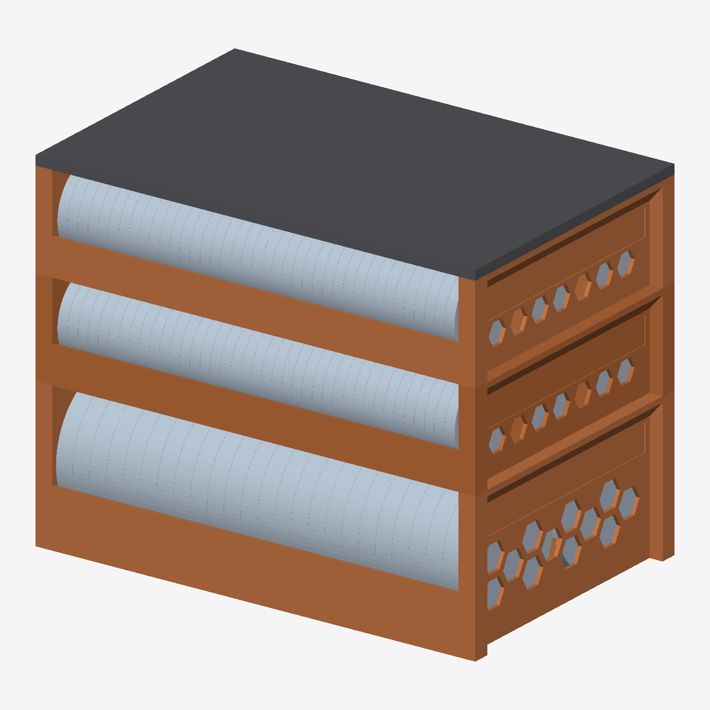

# Coin Vault

3D-printable storage trays for copper bullion in Air-Tite capsules. Coins stand on
edge, face to face, in a curved cradle, and a sliding bookend keeps a part-full row
upright. Everything is parametric OpenSCAD and prints with no supports.



## Parts

| File | Holds | Size (mm) | PLA |
|---|---|---|---|
| `coin_vault_tray_Y63.stl` | 48 × 5 oz rounds in Air-Tite **Y63** (Ø71.37 × 8.9) | 233 × 151 × 77 | ~210 g |
| `coin_vault_tray_H39.stl` | 117 × 1 oz rounds in Air-Tite **H39** (Ø44.45 × 5.4) | 233 × 151 × 50 | ~175 g |
| `coin_vault_lid.stl` | caps any stack | 233 × 151 × 5 | ~95 g |
| `coin_vault_bookend_Y63.stl` / `_H39.stl` | one per part-full row | | ~10 g / ~4 g |
| `slab_tray.stl` | 52 × 90 × 60 mm 5 oz slab capsules (7–8 mm thick), portrait | 233 × 151 × 55 | ~160 g |
| `slab_bookend.stl` | one per part-full row | | ~12 g |

Gram figures are estimates at 15% infill; your slicer has the final word.

**Coin trays stack.** The 5 oz and 1 oz trays share one footprint and corner-post
pattern, so they mix freely in a stack under the same lid. Tapered pins on the posts
locate each tray, and each tray's floor closes the one below it. The slab tray is a
standalone tray with carry handles. It does not stack, but it has the same footprint, so all
three line up on a shelf.

## Customizing

Open `coin_vault.scad` or `slab_tray.scad` in OpenSCAD and use **Window → Customizer**.
Keep `patterns.scad` in the same folder, because both files include it.

- `coin_vault.scad`: `capsule` (Y63 / H39), `part` (tray / lid / bookend / preview),
  rows and capsules per row (0 = as many as fit), clearances, end-wall opening pattern.
- `slab_tray.scad`: `footprint` (match the coin trays, or size from rows), `orientation`
  (portrait / landscape), `slab_t` (capsule thickness, default 8 mm), side and end wall heights.

Export with the Manifold backend (the default in current OpenSCAD).

## Strength

A full 5 oz tray holds about 8.7 kg. On a shelf the floor is supported everywhere. In a
stack, or when you lift it by the handles, the floor has to span about 217 mm between
the end walls. `sag_check.py` models that case conservatively: PLA long-term creep
modulus at E/3, sparse infill counted at 5% stiffness.

```
python sag_check.py Y63    # 5 oz: 0.96 mm worst case vs 1.85 mm clearance
python sag_check.py H39    # 1 oz: 0.73 mm worst case
```

These results set the design rules. Don't relax them to save filament:

- **Long walls stay solid.** Lattice openings in them made stacked sag 2.6× worse to
  save about 13 g.
- **The cradle floor is 3 mm thick at its lowest point.** At 1.2 mm the thin centre
  line acts as a hinge across the row.
- **Corner posts:** a 6-high stack of 5 oz trays stays at 4× their buckling margin.

## Printing

- PLA. It creeps less than PETG at room temperature. Keep it out of hot garages and
  attics, because PLA softens well below 60 °C.
- 15%+ infill (the cradle's stiffness depends on it), 0.2 mm layers, no supports.
- Print trays and the lid as modelled. Bookends print flat on their plate.
- End-wall openings are flat-top hexagons (short bridges only). Other patterns are in
  `patterns.scad`: diamond and teardrop are bridge-free, and X-brace is kept for
  reference only, since its triangle tops print badly.
- Store stacks on a solid shelf, not wire shelving.

## Files

- `coin_vault.scad`: stacking coin trays, lid, bookends
- `slab_tray.scad`: slab tray and bookend
- `patterns.scad`: shared wall-opening patterns
- `sag_check.py`: conservative stiffness check (numpy)
- `render.py`: tiny z-buffer STL preview renderer (numpy, trimesh, pillow)
- `out/`: exported STLs and preview images
